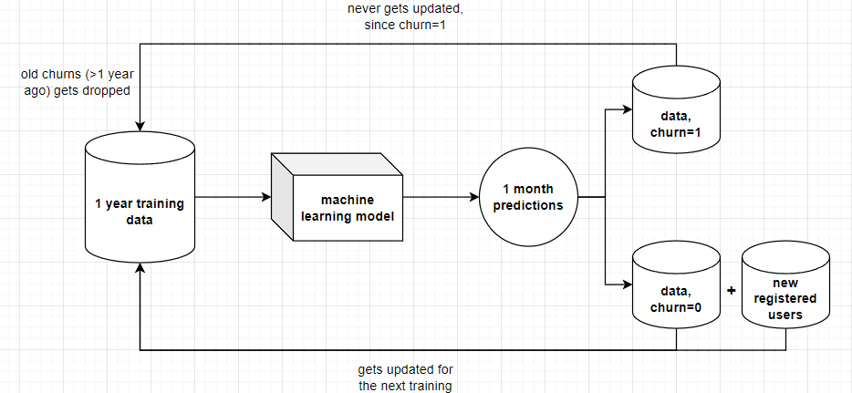

# Customer churn prediction, OLX task 30.11.2023 (Rybczyński Jędrzej)

## 1. Problem definition and goal

What is a **customer churn** (attrition, turnover)? <br>
In simple words: **probability of leaving the company.**
In order to keep business healthy, it is crucial to pay attention to customers with a high churn rate and retain customers with a low churn rate to sustain long-term growth.

Okay, so the target variable is binary: **churn** (yes/no). We can predict customers with a high churn probability, but can how we affect them?
- Send them personalized newsletters
- Launch a specific promotion 
- Direct contact through company representatives

## 2. Data source

In practice, we will need to have **one row of data per each user**, this data can be gathered from **CRM systems** or **analytics services**. Probably, some **human feedback** will be needed to build an initial dataset, to annotate which users have churned or not so far. This is easier for companies from sectors such as banks or telcos, since clients there have to submit their resignation 'directly'. However, I think this isn't the case for a company such as OLX, since customers hardly delete their accounts, more often they simply stop to use them. So, how to handle this properly?

### Sliding window, 'time-series' concept

Let's do this in that way, consider only **the customers who have left in the last one year** (so we will have last year churns + active users in training data) and try to predict the churn for the future 1 month (alernatively x months). The Model needs to be retrained every 1 month (x months). During each retraining we will exclude users that have churned over one year ago and include new churns from the latest month + new  registered users. Active users (no churn) will stay the same with updated features.

Of course, adding churns from the latest month predictions directly to the future training data can make it biased, so it's good to incorporate some human-feedback whether the predicted churn is an actual churn. (at least every 2-3 months).

## 3. Data representation

For data representation, some specific features can help the model to predict the churn, I came across three main categories:
- general features
- purchase-based features
- sale-based features

I think it's reasonable to use **monthly aggregations** for some of them, since our prediction will have a one month scope. Moreover, it's important to collect **user activity data from the past one year.** (there's no point in collecting total data till user registration date, since we're operating on the last 1 year). 

### General features

These are some general website activity related features about the user, for example: 
- user_id
- days since registration
- days since the last login 
- monthly averaged number of logins
- monthly averaged messages
- aggregated number of interactions at the website 
- geographic features, voivodeship
- implicit feedback about satisfaction
- etc...

### Purchase-based features
- favourite category of the searched products
- monthly averaged messages regarding purchases
- show phone number interactions
- average money spent on purchases (with shipping)
- days since last purchase (with shipping)
- total number of purchases (with shipping)
- etc...

### Sale-based features
- favourite category of the sold products
- last year ads created
- days since the last ad created
- monthly averaged messages regarding sales
- total money spent on promoting the ads
- number of ads promotions bought
- etc...

Plus, of course `churn` (target) and `churn_date` (only for `churn=1` to know when to get rid of outdated >1 year churns).

Of course, the above features are just some ideas. We will need to perform some feature selection, statistical tests to determine whether they are significant.

| user_id | days_since_registration | days_since_login  | ... | ads_created | money_spent_ads | churn_date | churn |
| --- | --- | --- | --- | --- | --- | --- | --- |
| 5fc63d42a147875f |213 | 88 | ... | 3 | 15.0 | 01.07.2022 | 1 |
| 5fc63d42a167877h |36 | 1 | ... | 2 | 0.0 | None | 0 |
| ... | ... | ... | ... | ... | ... | ... | ... |
| 7fc63d42a167821c |125 | 125 | ... | 0 | 0.0 | 01.12.2022 | 1 |

## 4. Modeling & evaluation

### Feature engineering

As I have already mentioned above, it is important to perform some sort of feature selection, for example:
- using RFE
- statistical tests to select features significantly correlated with target variable
- post model training feature importance (for tree-based model, or coefficients for linear ones)

### Modeling 

SoTa classification models like tree based models (GBDT <3), RF or linear ones like Logistic Regression, SVC. <br>
Be aware of highly imbalanced classification, it's obvious that we will have more active users than churned from the last year.

### Evaluation

As it comes to the evaluation, I'd go for the hold out validation set (**stratified** since class imbalance). Then, cross-validation on remaning training data for hyperparameter tuning. Additionally, ROC AUC / MCC as evaluation metrics (again since class imbalance). Moreover, the problem nature is that False Positives are more dangerous than False Negatives (Precision > Recall), if we wrongly predict someone as churned we're gonna lost his data point, wrongly predicting him as non-churn – we're simply giving him a chance for the next month.

### Threshold tuning

This involved the previous thought, having less FP is more important than FN from the model & architecture side. But on the other hand, having too much FN is also not desired – OLX is loosing customers without taking any steps towards. That's why proper threshold tuning is crucial for this type of task, for which probablity score we treat user as churned.

## 5. Deployment & monitoring & retraining

### Deployment

Since prediction will be made only one time per month, in my opinion offline learning, batch inference is preferred. Retraining will be made together with inference. Application could be deployed as docker image or cloud pipelines (i.e. AWS step functions) triggered monthly, integrated with some database where predictions will be stored. Historical models along with predictions & input data needs to be also properly versioned based on prediction date.

### Monitoring

To monitor concept/data drift it's good to integrate it with service like [whylabs.ai](https://whylabs.ai/). It's also good to integrate some sort of explainability on the sample level using SHAP or LIME to see which input features contribute the most to prediction. What I already mention at the beginning, ideally some human feedback loop will be appreciated as well (at least for `churn=1`). 

### Retraining

For the sake of better understanding, I've prepared a following diagram how retraining & model lifecycle will work: <br><br>



Let's go through an example, we've used a time machine and it's 01.01.2023. Originally we have been training and evaluating the model on data from the whole 2022 (or even better training & evaluation on 2021 and just refit on the whole 2022). By making the first predictions, these are predictions for the whole January 2023. We got some churns that haven't been included before, we're updating these churns to dataset with `churn_date=01.01.2023` and excluding old churns with churn_date > 1 year. In the next month, on 02.01.2023, we update active users data with `churn_date=0`, since their activity gets updated during the whole month and repeat the whole retraining & prediction step.

Once again, this isn't included in the diagram, but some human feedback would be appreciated if correct users have been churned.


```python

```
